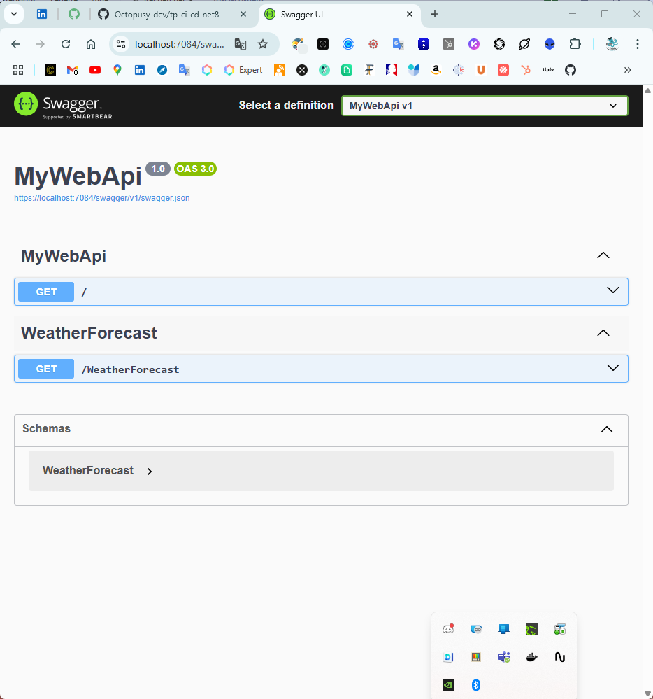

[](https://classroom.github.com/online_ide?assignment_repo_id=19319439&assignment_repo_type=AssignmentRepo)
# 🧪 TP – Déploiement CI/CD d'une Web API .NET 8 sur Azure

## 🎯 Objectif

À partir d’une Web API en .NET 8 fournie, vous devez :

1. Créer une **Azure Web App** (Linux, .NET 8)
2. Mettre en place un pipeline **CI/CD avec GitHub Actions**
3. Automatiser les étapes de :
   - Compilation
   - Tests
   - Publication sur Azure

---

## 🧰 Pré-requis

- Un **compte GitHub**
- Un **compte Azure**
- Le **code fourni** (Web API .NET 8)
- Visual Studio / VS Code
- Git installé


> Ce Tp faire suite a la demo du formateur donc ne detaille pas toutes les etapes
> Il faut bien ecouter et regarder ce qui se passe 

---

## 📦 Partie 1 – Récupération du projet

Clonez le projet de démarrage :

```bash
git clone https://github.com/ton-orga/webapi-starter-dotnet8.git
cd webapi-starter-dotnet8
```

> Le projet à builder se trouve dans le dossier `MyWebApi`

Testez le lancement local :

```bash
dotnet run --project MyWebApi/MyWebApi.csproj
```
- De base vous aller voir afficher _hello word_

- si vous rajouter /swagger a la fin de l'url 

---

## ☁️ Partie 2 – Création de la Web App sur Azure

1. Connectez-vous à [https://portal.azure.com](https://portal.azure.com)
2. Créez une **Web App** :
   - **Nom** : `webapi-votreprenom`
   - **Runtime** : `.NET 8`
   - **Système** : `Linux`
   - **Région** : Europe ou proche
   - **Plan App Service** : Gratuit (F1) ou B1
3. Accédez à la Web App > **Centre de déploiement** > **Configurer manuellement plus tard**
4. Allez dans **"Profil de publication"** :
   - Téléchargez le **fichier XML**
   - Gardez ce fichier pour l’étape GitHub

> il se peut que ce ne soit pas aussi facile ;)
---

Parfait ! Voici une version mise à jour de la **Partie 3**, plus pédagogique, en proposant aux étudiants d’utiliser un **template GitHub Actions** pour démarrer plus facilement.

---

## 🔐 Partie 3 – Configuration des secrets GitHub & création du pipeline

### 🔑 Étape 1 – Ajouter les secrets GitHub

1. Allez sur votre dépôt GitHub
2. Ouvrez l’onglet **`Settings`** > **`Secrets and variables`** > **`Actions`**
3. Cliquez sur **`New repository secret`**

Ajoutez ces deux secrets :

| Nom du secret             | Valeur |
|---------------------------|--------|
| `AZURE_WEBAPP_NAME`       | Nom de votre Web App (ex. `webapi-votreprenom`) |
| `AZURE_PUBLISH_PROFILE`   | **Contenu** du fichier XML de profil de publication |

> 📄 Pour récupérer le `AZURE_PUBLISH_PROFILE`, ouvrez le fichier `.PublishSettings` téléchargé depuis Azure, copiez tout son contenu, et collez-le dans le champ du secret.

---

### ⚙️ Étape 2 – Créer le pipeline à partir d’un template

GitHub propose des **modèles de workflow**. Pour créer votre pipeline :

1. Allez dans l’onglet **`Actions`** de votre dépôt GitHub
2. Cliquez sur **`Configure`** à côté de **"Deploy .NET Core app to an Azure Web App"**
3. Dans le fichier généré (`azure-webapps-dotnet-core.yml`) :
   - Remplacez `myappname` par `\${{ secrets.AZURE_WEBAPP_NAME }}`
   - Remplacez `<publish-profile>` par `\${{ secrets.AZURE_PUBLISH_PROFILE }}`
   - Modifiez le chemin du projet `.csproj` si nécessaire (ex : `MyWebApi/MyWebApi.csproj`)
4. Sauvegardez et validez le fichier dans `.github/workflows/`

> 🧠 Cela vous permet de gagner du temps tout en personnalisant votre pipeline.

---

## 🚀 Partie 4 – Lancement du déploiement

1. Poussez le fichier `azure-webapps-dotnet-core.yml` sur la branche `main`
2. Allez dans l’onglet `Actions` du repo GitHub
3. Vérifiez l'exécution du pipeline
4. Accédez à votre Web App via l'URL Azure :  
   `https://webapi-votreprenom.azurewebsites.net`

---

## ⭐ Bonus (Facultatif)

- Ajouter un badge GitHub Actions dans le `README.md`
- Ajouter un test unitaire s’il n’y en a pas
- Ajouter une étape de `dotnet format`
- Ajouter un slot de préproduction sur Azure
- Utiliser un environnement GitHub pour déploiement conditionnel
- Separer en 2 pipeline CI.yml et CD.yml
